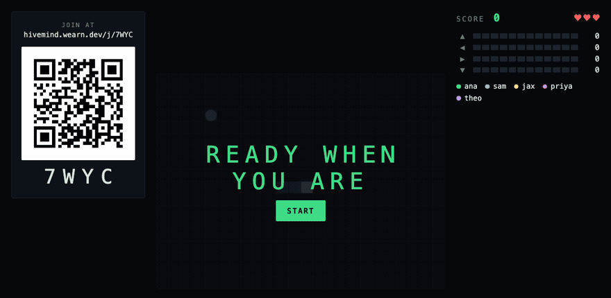
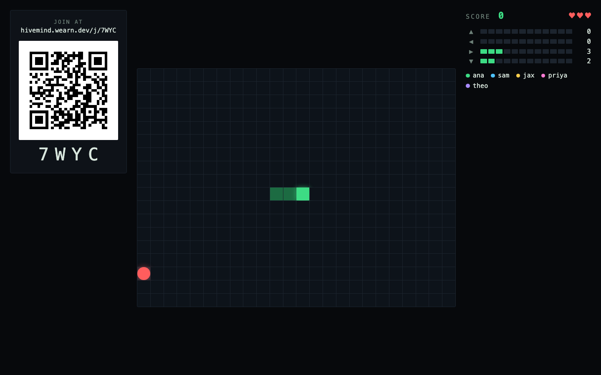
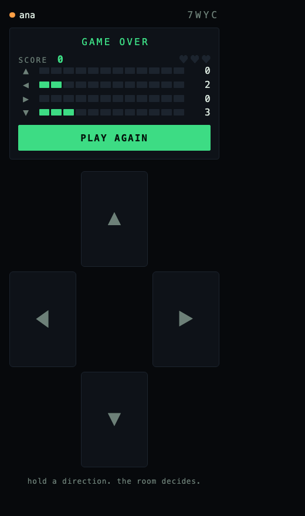

# hivemind

**One snake. Everybody steers.**

A Jackbox-style party game. One screen goes on the television; everyone else
joins from their phone by scanning a QR code. Every tick, the server tallies
every player's vote and the plurality direction wins — so the snake goes
wherever the room can agree to send it, which is rarely where anyone intended.

Go, htmx, and server-sent events. No JavaScript framework, no database, and one
static binary.



<sub>A real recorded round. Watch the tally on the right — the snake turns when
the room does.</sub>

| The television | Your phone |
|---|---|
|  |  |

## Try it

```bash
make party
```

That runs the server bound to your LAN address and prints a URL. Open it on a
laptop, scan the QR with a couple of phones, and press start. (`make run` binds
to localhost instead, which is fine for development but produces a QR code that
phones can't reach.)

Or from the published image:

```bash
docker run --rm -p 8080:8080 \
  -e HIVEMIND_BASE_URL=http://192.168.1.10:8080 \
  ghcr.io/jcwearn/hivemind:1
```

## How it works

Three decisions carry most of the design.

### SSE down, form posts up

State flows to the browser over server-sent events. Player input flows back over
ordinary `hx-post` form submissions. There is no WebSocket anywhere in the
program.

SSE is plain HTTP, which means it crosses a reverse proxy or a Cloudflare Tunnel
with no configuration, reconnects on its own when a phone wakes from sleep, and
can be read in a test with a `bufio.Scanner`. Input is low-frequency and
discrete — a vote, a join, a start — which is exactly the shape a form post
already has. A bidirectional socket would have bought nothing and cost a
keepalive protocol, a reconnect strategy, and a harder test harness.

The one thing SSE demands in return is a heartbeat: Cloudflare cuts an idle
connection at 100 seconds, and a room waiting in its lobby produces no frames at
all. So an idle stream emits a comment every 20 seconds.

### One goroutine per room

A room's state — the game, the players, the subscriber set — is owned by a
single goroutine and touched by nothing else. Every mutation arrives as a
command on a channel:

```go
func (r *Room) run() {
    for {
        select {
        case <-r.quit:     return
        case c := <-r.cmds: c.apply(r)   // join, vote, start, subscribe
        case <-ticker.C:    r.step()     // tally → advance → render → broadcast
        case <-idle.C:      /* collect an empty room */
        }
    }
}
```

**No mutex guards any game state.** The only lock in the program is the one in
`lobby.Registry` protecting a `map[string]*Room`, and it guards the map rather
than anything inside a room.

A pleasant side effect: because `apply` lives on the command rather than in a
type switch behind the channel, the whole state machine can be tested
synchronously, with no goroutine and no timing at all. The tests that need
real concurrency are then few enough to write carefully.

### Render once, broadcast N times

A tick renders the board to one `[]byte` and hands that same slice to every
subscriber. Rendering is O(1) in the number of players, not O(n).

If a subscriber's buffer is full, the frame is **dropped** rather than blocked
on:

```go
frame := r.renderFrame()          // rendered ONCE per tick
for s := range r.screens {
    select {
    case s.ch <- frame:
    default:
        r.dropped++               // slow client; the next snapshot heals it
    }
}
```

That is safe precisely because every frame is a complete state snapshot rather
than a delta — a phone that misses one is fully repaired by the next, about
300ms later. The result is that one bad connection degrades its own frame rate
and nobody else's, which is asserted directly in
[`TestSlowSubscriberDoesNotBlockTheRoom`](internal/lobby/room_test.go).

The same property is why the controller's four buttons are *outside* the
SSE-swapped region. Which button looks pressed is per-player state, and
broadcasting it would cost one render per phone per tick to tell each person
something their own browser already knew. So the server owns the shared status
and the browser owns the highlight.

## Layout

```
cmd/hivemind/      wiring, slog, graceful shutdown
internal/game/     the rules: pure functions, no I/O, no clock
internal/lobby/    registry, room actor, subscriber fan-out
internal/web/      routing, SSE, signed cookies
internal/ui/       templ components (*_templ.go committed)
static/            styles, ~30 lines of JS, vendored htmx
```

`internal/game` is a pure package: `Step(State, Direction, *rand.Rand) State`,
with no clock and no global randomness. The tick loop owns time; the rules own
nothing else. That is what makes the entire rule set exhaustively table-testable
without a single fake, and it is why the interesting bugs in this program can't
hide there.

## Dependencies

The whole of `go.mod`, runtime side:

- [`github.com/a-h/templ`](https://github.com/a-h/templ) — compiled, type-safe
  templates
- [`rsc.io/qr`](https://pkg.go.dev/rsc.io/qr) — exposes the raw module matrix,
  so the join code renders as an inline SVG `<path>` with no image encoding

Routing is `net/http`'s own `ServeMux` — Go 1.22's method and wildcard patterns
(`GET /r/{code}/screen`) cover everything a third-party router would. SSE,
templating, and testing are all standard library.

htmx and its SSE extension are vendored into `static/` rather than loaded from a
CDN, so the binary has no network dependencies at all and a party in a room with
bad wifi isn't one CDN timeout from an unusable controller.

## Development

```bash
make help       # list targets
make test       # go test -race ./...
make lint       # the version pinned in .golangci-lint-version
make generate   # regenerate templ output
make party      # run on the LAN
```

The `*_templ.go` files are committed. That's what lets `go build` work on a
fresh checkout with no templ installed, and lets the Dockerfile skip a codegen
stage entirely — at the cost that generated output can go stale, which
[`codegen.yml`](.github/workflows/codegen.yml) makes impossible to merge.

### Configuration

| Variable | Default | Notes |
|---|---|---|
| `HIVEMIND_ADDR` | `:8080` | Listen address |
| `HIVEMIND_BASE_URL` | `http://localhost:8080` | Public origin. **This is what goes in the QR code**, so behind a proxy it must be the address phones can reach |
| `HIVEMIND_LOG_LEVEL` | `info` | `debug`, `info`, `warn`, `error` |
| `HIVEMIND_COOKIE_SECRET` | generated | Signs the player cookie. Unset means an ephemeral one, and players lose their seats on restart |

## Deployment

Two instances, deliberately, on different domains:

| | Host | Runs on | Reachable from |
|---|---|---|---|
| **Public** | `hivemind.jacksonwearn.com` | Cloudflare Container ([`edge/`](edge/)) | anywhere |
| **Internal** | a private hostname | k3s homelab | the tailnet |

They are separate processes with separate rooms — the internal one is the
staging environment. See [`edge/README.md`](edge/README.md) for the public path.

The image is `ghcr.io/jcwearn/hivemind`, published by
[`jcwearn/workflows`](https://github.com/jcwearn/workflows)'s shared
`release.yaml` on merge, tagged `1.2.3` / `1.2` / `1` / `sha-abc1234`. The
container deployment builds its own image from the same Dockerfile, because
Cloudflare cannot pull from GHCR.

**Run exactly one replica.** Room state is in memory by design — there is no
database, nothing is persisted, and rooms are collected ten minutes after the
last person leaves. Two replicas would mean two disjoint sets of rooms and a
coin flip over which one a player's phone reaches. The k3s manifests pin
`replicas: 1` with `strategy: Recreate` for that reason.

Sitting behind Cloudflare Tunnel needs no Cloudflare-side configuration beyond
the hostname; SSE crosses it as ordinary HTTP.

## What's deliberately not here

- **No database.** Nothing is persisted. The container is stateless and
  disposable, and a restart costs a party its current round.
- **No accounts.** A signed cookie holds a random id so a phone keeps its seat
  through a locked screen. It means nothing to anyone else.
- **No horizontal scaling.** See above.
- **No `Game` interface.** There is one game. An interface designed against a
  single implementation is a guess, so it gets extracted when there is a second
  one to extract it from.

## Licence

MIT.
